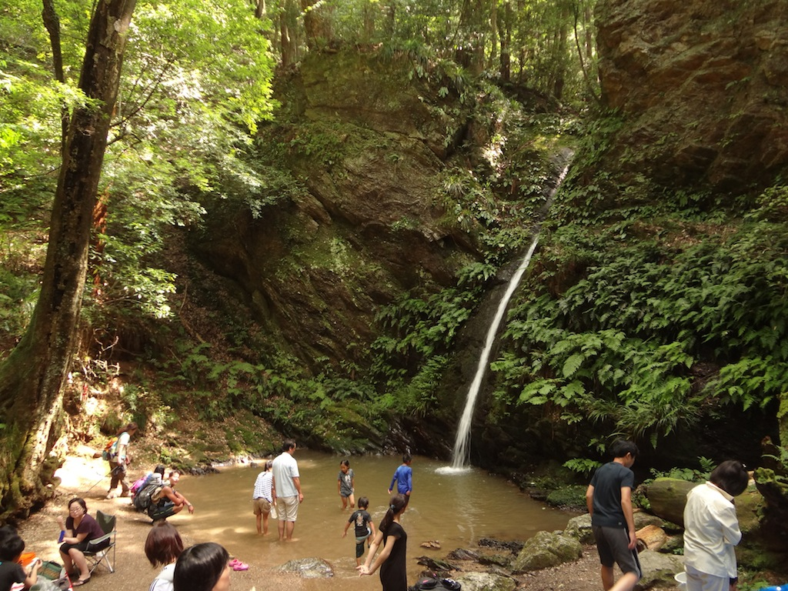

## Access ##
Higashiagano station is on the Seibu line.

## Points of Interest ##

 - Yugate forest (ユガテ森) (actually, sunflower patch)
 - Kamakita lake (鎌北湖)
 - Shukuya waterfall (宿谷の滝)
 - mt. Monomi (物見山)
 - Gojo waterfall (五常の滝)

## Course ##
From Higashiagano station follow signs to Yugate (ユガテ). Along the road be careful not to miss the small pole-shaped sign where you should turn right. There will be a lot of concrete, but be patient.

Yugate (ユガテ) is a patch of sunflowers. A very good place for a lunch break. There's a small toilet.

From Yugate, it's a nice path to Kamakita lake (鎌北胡). Before you reach the lake, you'll see a toilet on your right. Head left towards the parking lots and cross the second one. You'll find a small bridge across the river. This takes you to a pleasant hiking path around the lake - much better than the hot road on the other side.



When you reach the Lakeview hotel, keep walking to the parking lot. There's a toilet and a pleasant little restaurant there. Cross the parking lot, climb the staircase and follow signs to the waterfall. The forest path goes up and then down. After you cross the road, there'll be a staircase leading to Shukuya waterfall (宿谷の滝). There will be a small place with benches. Head left from there.

Shukuya waterfall is gorgeous and a great place for children to play. Families come there by car, via the nearby road.

Climb back up the staircase to the benches and take the path with the small 小滝 sign. From then on, signs will point to Monomi-yama (物見山). Be prepared for a bit of a climb up - a small price to pay for Shukuya waterfall. This is definitely the hardest part of the hike, but the steep climb is not long.

From the top, signs will point at Musashi Yokote station (武蔵横手駅). When you reach gardens, take the path going down. At some point the path will become a paved road, head left (you want to descend anyway). Watch out for the small sign pointing at the Gojo waterfall (五常の滝).



Gojo waterfall is smaller, but nonetheless picturesque. You can take the hiking path along the stream, it will take you back to the paved road. The road will take you to Musashi Yokote station.

One final attraction are the goats residing next to Musashi Yokote station.
